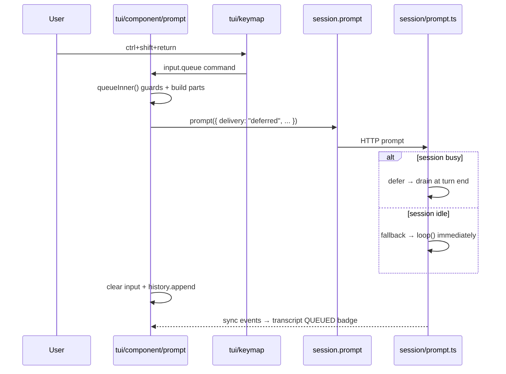

# Main TUI Prompt Queue — Implementation Plan

> **Superseded** by [PLAN_UNIFIED_PROMPT_QUEUE.md](./PLAN_UNIFIED_PROMPT_QUEUE.md). Queue UX is implemented via `session.queue.*` and `prompt_queue` sync, not `delivery: "deferred"`.

**Location:** repo root — `PLAN_MAIN_TUI_QUEUE.md` (not deleted; keep this file until the queue PR merges to `production`, then remove it).

Branch target: `production`
Status: **living plan** — tracks remaining UX (queue dock + edit) in addition to main-TUI wiring.

## Problem

Deferred prompt queueing (`delivery: "deferred"`) ships today on:

| Surface | Status |
|---------|--------|
| Backend (`session/prompt.ts`, `run-state.ts`) | ✅ Merged |
| Web app (`packages/app`) | ✅ Merged |
| Direct run TUI (`opencode run --interactive`, `cli/cmd/run/*`) | ✅ Merged — `ctrl+shift+return` default |
| **Main TUI** (`opencode`, `cli/cmd/tui/component/prompt`) | ✅ Phase A + B in PR |
| **Queue list + edit (both TUIs)** | ✅ Phase B — dock + edit + **Alt+Up** in main and run TUI |

Users expect the queue hotkey in the main TUI because:

1. `input_queue` already exists in `tui/config/keybind.ts` with default `ctrl+shift+return`.
2. `CommandMap` maps `input_queue` → `"input.queue"`.
3. Nothing registers or handles the `input.queue` command.
4. `registerManagedTextareaLayer` only binds `inputCommands` in `keymap.tsx` — **`input.queue` is intentionally excluded** (same Gap 17 as run footer: queue must not be a textarea submit/newline action).

The main TUI **does** already render a `QUEUED` badge on user messages when they arrive after an in-flight assistant turn (`routes/session/index.tsx` `UserMessage`, driven by the `pending` assistant id memo). That badge is **not** a substitute for the web **followup dock** — users still need a list of pending messages with **Edit** / **Send now**, not only a transcript label.

**Run TUI gap:** `footer.view.tsx` shows only `{queue()} queued` beside usage hints. No per-message preview, no edit affordance, no keyboard path to edit — insufficient vs web.

---

## Goals

### Phase A — Main TUI queue submit (MVP)

1. **Ctrl+Shift+Enter** (configurable via `keybinds.input_queue`) queues the current prompt in the main TUI.
2. Queue uses **`delivery: "deferred"`** on the existing session prompt API — same backend path as web and run TUI.
3. Guards match run TUI / web semantics:
   - Normal mode only (no queue in shell mode).
   - Ignore empty/whitespace-only input.
   - Slash commands submit immediately (not queued).
   - Disabled prompt (permissions/questions open) → no-op.
4. Keybind shows in help / which-key via existing config description.

### Phase B — Queue dock + edit (both TUIs) — **required before calling queue “done”**

Match web `SessionFollowupDock` (`packages/app/src/pages/session/composer/session-followup-dock.tsx`):

| Web behavior | TUI requirement |
|--------------|-----------------|
| Collapsible tray above composer | Dock panel above prompt (main TUI + run footer stack) |
| Summary: “N messages queued” + first-line preview when collapsed | Same copy/i18n keys where possible |
| Expanded list: truncated text per item | One row per queued message |
| **Edit** button per item | Select/focus row + **Edit** action (or primary click) |
| **Send now** per item | Optional phase-B.1; web has it — include if low cost |
| `editFollowup(id)` → remove from queue, load draft into prompt | TUI: load text/parts into prompt; clear input history noise |

**Keyboard (Codex parity):**

- Default: **`Alt+Up`** (`alt+up` in `keybinds` — same chord as Codex for “edit queued message”).
- New keybind id: `input_edit_queue` (name TBD: `input.queue.edit`).
- Command: `input.queue.edit` — when queue non-empty, edit the **most recently queued** item (or focused row if dock has selection); no-op when queue empty or prompt disabled.
- Register via `useBindings` on prompt target — **not** in `inputCommands` / textarea layer (same rule as `input.queue`).
- Document in `keybind.ts` description + which-key; overridable via `keybinds.input_edit_queue` in `tui.json`.

**Two queue sources (implement both paths):**

1. **Client-side queue (pre-submit)** — run `runtime.queue.ts` `state.queue[]`, web `followup.items` via `onQueue`:
   - Edit = splice item from queue, hydrate prompt (no server round-trip).
   - Dock reads this list directly.

2. **Server-persisted deferred** (`delivery: "deferred"` on `session.prompt` — main TUI Ctrl+Shift+Enter, run `onQueue` with deferred):
   - Messages already in DB with `QUEUED` badge.
   - Edit = **`session.revert`** (or delete message API if available) for that user message, then load parts into prompt — mirror web `editFollowup` semantics.
   - Dock lists deferred user messages from sync (`delivery === "deferred"` && not yet consumed by runLoop), merged with client queue for display order.

**Run TUI:** Replace footer-only `{n} queued` with full dock component; keep footer count as optional secondary hint or remove once dock visible.

**Main TUI:** Add dock above `tui/component/prompt`; do not rely on transcript `QUEUED` badge alone.

### Follow-ups (later PRs)

- Queue-mode toggle in prompt chrome (parity with web bullet-list button).
- TUI setting for default follow-up behavior (steer vs queue) if we add steer semantics client-side.
- Cherry-pick to `dev` once dev’s plugin TUI prompt path is confirmed stable.
- Web: optional `Alt+Up` to edit last queued followup (today web uses dock buttons only; `alt+arrowup` is session navigation in `layout.tsx`).

---

## Reference implementations

Copy behavior from these; do not re-invent queue semantics.

| Concern | Reference |
|---------|-----------|
| Deferred API field | `packages/app/src/components/prompt-input/submit.ts` → `sendFollowupDraft({ delivery: "deferred" })` |
| Followup dock UI + edit | `packages/app/src/pages/session/composer/session-followup-dock.tsx` |
| Edit → prompt hydration | `packages/app/src/pages/session.tsx` → `editFollowup`, `followup.edit` |
| Client queue before send | `packages/app/src/pages/session.tsx` → `queueFollowup`, `submit.ts` `onQueue` branch |
| Run TUI enqueue guards | `packages/opencode/src/cli/cmd/run/footer.prompt.tsx` → `onQueue()` |
| Run TUI in-memory queue | `packages/opencode/src/cli/cmd/run/runtime.queue.ts` → `state.queue`, `enqueue()` |
| Run TUI footer badge only | `packages/opencode/src/cli/cmd/run/footer.view.tsx` → `{queue()} queued` (**replace with dock**) |
| Run TUI keybind resolution | `packages/opencode/src/cli/cmd/run/prompt.shared.ts` → `queues` separate from textarea `bindings` |
| Backend idle fallback | `packages/opencode/src/session/prompt.ts` — deferred + no runner → immediate turn |
| Backend mid-turn defer fix | `packages/opencode/src/session/prompt.ts` — exclude deferred from steer injection / `latestActiveUser` |
| Transcript QUEUED badge | `packages/opencode/src/cli/cmd/tui/routes/session/index.tsx` → `UserMessage` + `pending` memo |

---

## Architecture



### Why a command, not a textarea binding

OpenTUI’s managed textarea layer (`keymap.tsx` `inputCommands`) handles `input.submit` and `input.newline` natively. Queue must **not** join that list — it would race Enter handling and cannot express `delivery: "deferred"`.

Pattern: register **`input.queue`** as a prompt-targeted command via `useBindings`, same family as `prompt.submit` / `session.interrupt`.

---

## Implementation steps

### 1. Register `input.queue` command

**File:** `packages/opencode/src/cli/cmd/tui/component/prompt/index.tsx`

Add to `promptCommands` (or adjacent `useBindings` block):

```ts
{
  title: "Queue prompt",
  name: "input.queue",
  category: "Prompt",
  hidden: true,
  enabled: () =>
    !props.disabled &&
    store.mode === "normal" &&
    Boolean(props.sessionID) &&
    status().type !== "idle", // optional UX: only when a turn is active
  run: async () => {
    if (!input.focused) return
    await queue()
  },
},
```

**Binding wiring** — extend the existing palette `useBindings` gather list **or** add a dedicated block:

```ts
useBindings(() => ({
  target: inputTarget,
  enabled: () => inputTarget() !== undefined && !props.disabled && !auto()?.visible,
  commands: [/* input.queue command from above */],
  bindings: tuiConfig.keybinds.get("input.queue"),
}))
```

Do **not** add `"input.queue"` to `inputCommands` in `keymap.tsx`.

> **Idle fallback note:** Backend accepts deferred on idle sessions and starts an immediate turn. Enabling the command while `status().type === "idle"` is still correct but indistinguishable from Enter for the user. Optional: keep enabled always in normal mode and rely on backend fallback; or disable when idle to match mental model (“queue only while agent is working”). **Recommend:** enable whenever input is non-empty + normal mode; document that idle queue ≡ submit.

### 2. Implement `queue()` alongside `submit()`

**File:** `packages/opencode/src/cli/cmd/tui/component/prompt/index.tsx`

Refactor minimally:

1. Share an **`inFlight` guard** with `submit()` (same double-submit race as Enter).
2. Extract **`preparePromptPayload()`** from `submitInner()`:
   - IME/plainText sync
   - extmark / pasted text expansion
   - editor context parts
   - non-text file parts
   - Returns `{ sessionID, messageID, parts, agent, model, variant, inputText, currentMode }` or `undefined` on validation failure.
3. **`queueInner()`** calls `preparePromptPayload()`, then:

```ts
void sdk.client.session.prompt({
  sessionID,
  messageID,
  agent: agent.name,
  model: selectedModel,
  variant,
  delivery: "deferred",
  parts: [/* same as submit */],
})
```

4. Reuse post-send cleanup from `submitInner()`:
   - `history.append`
   - clear extmarks / prompt store
   - `input.clear()`
   - **Do not** navigate for new-session case the same way unless session already exists (queue on home with no session → treat as submit/create — defer is meaningless without a runner).

**Guards (early return false):**

| Condition | Behavior |
|-----------|----------|
| `props.disabled` | no-op |
| `workspaceCreating()` | no-op |
| `auto()?.visible` | no-op |
| empty trimmed input | no-op |
| no agent / model | same warnings as submit |
| `store.mode === "shell"` | no-op |
| slash command input | no-op — run command path instead or ignore |
| no `props.sessionID` on home route | **submit/create path** — queue before first session exists has no in-flight runner; either call normal submit or block with toast (“Start a session first”) |

**Recommendation for home route:** fall through to normal `submit()` (backend idle fallback handles it). Simpler, no dead key on new session screen.

### 3. Expose on `PromptRef` (optional)

**File:** `packages/opencode/src/cli/cmd/tui/component/prompt/index.tsx`

```ts
queue() {
  void queue()
},
```

Useful for plugin hooks / future toggle button.

### 4. Help / discoverability

**Files:**

- `packages/opencode/src/cli/cmd/tui/config/keybind.ts` — description already mentions override; update text to say “Main TUI + run interactive”.
- Which-key / tips plugin — add one tip: “Queue follow-up: Ctrl+Shift+Enter” (follow-up PR if tips are generated separately).

No change to `CommandMap` — `input_queue: "input.queue"` is already correct.

### 5. No backend changes required

Backend deferred queue, idle fallback, and runLoop drain are merged. SDK types already include `delivery?: SessionDelivery`.

### 6. Run TUI parity check (no code change expected)

Run interactive mode already uses `ctrl+shift+return` via `runtime.boot.ts` + manual `onKeyDown`. Keep defaults aligned; config key remains `input_queue` everywhere.

---

## Files to touch

### Phase A (main TUI queue submit)

| File | Change |
|------|--------|
| `packages/opencode/src/cli/cmd/tui/component/prompt/index.tsx` | `queue()`, `preparePromptPayload()`, `input.queue` command + bindings |
| `packages/opencode/src/cli/cmd/tui/config/keybind.ts` | Description tweak only |
| `packages/opencode/test/cli/tui/prompt-queue.test.ts` | **New** — unit tests for payload + guards |
| `packages/opencode/test/cli/tui/prompt-submit-race.test.ts` | Extend or mirror for queue in-flight guard |

### Phase B (queue dock + edit — both TUIs)

| File | Change |
|------|--------|
| `packages/opencode/src/cli/cmd/tui/component/prompt/queue-dock.tsx` (new) | Collapsible dock UI shared by main TUI |
| `packages/opencode/src/cli/cmd/tui/component/prompt/index.tsx` | Mount dock; wire `input.queue.edit`; edit hydration |
| `packages/opencode/src/cli/cmd/run/footer.queue-dock.tsx` (new) or extend `footer.view.tsx` | Run interactive dock above prompt |
| `packages/opencode/src/cli/cmd/run/footer.prompt.tsx` | Edit/send handlers; expose queue items to dock |
| `packages/opencode/src/cli/cmd/run/runtime.queue.ts` | `editQueued(index)`, `removeQueued`, list snapshot for UI |
| `packages/opencode/src/cli/cmd/run/runtime.boot.ts` | Pass queue state + handlers into footer |
| `packages/opencode/src/cli/cmd/tui/config/keybind.ts` | `input_edit_queue: alt+up` + `CommandMap` entry |
| `packages/opencode/src/cli/cmd/run/prompt.shared.ts` | Resolve `input_edit_queue` for run footer `onKeyDown` |
| `packages/app/src/i18n/en.ts` (and siblings) | Reuse `session.followupDock.*` strings in TUI if feasible |

**Explicitly do not modify:** `keymap.tsx` `inputCommands` array (queue + edit queue are commands, not textarea bindings).

---

## Test plan

### Unit (`packages/opencode`)

```bash
bun test test/cli/tui/prompt-queue.test.ts
bun test test/cli/tui/prompt-submit-race.test.ts
```

Cases:

1. `queue()` sends `delivery: "deferred"` on prompt API mock.
2. Shell mode → queue not called.
3. Empty input → queue not called.
4. Concurrent queue + submit → only one in-flight (shared guard).
5. Slash command text → queue not called.
6. Keybind command `input.queue` registered when prompt focused.

### Phase B tests

```bash
bun test test/cli/tui/prompt-queue-dock.test.ts   # new
bun test test/cli/run/footer.queue-dock.test.tsx  # new
```

Cases:

1. Dock shows N items with truncated first line (collapsed + expanded).
2. **Edit** on row removes item from queue and sets prompt text (client queue).
3. **Alt+Up** triggers same path as Edit for last queued item.
4. Deferred message on server: edit reverts message ID and loads parts into prompt (integration or mocked SDK).
5. Run TUI: dock visible when `queue > 0`; footer may still show count but dock is primary UI.

### Manual

**Phase A**

1. `opencode` → open session → start a long turn.
2. Type follow-up → **Ctrl+Shift+Enter**.
3. Input clears; user message appears with **QUEUED** badge; agent finishes current turn; queued message runs next.
4. Repeat on idle session → message sends immediately (backend fallback).
5. Override `keybinds.input_queue` to `f9` in `tui.json` → confirm rebind works.
6. Shell mode (`!`) → queue key does nothing.

**Phase B**

1. Queue 2+ messages → dock lists all with previews (not only footer `2 queued`).
2. Click **Edit** on second item → prompt contains that text; dock no longer lists it.
3. **Alt+Up** with one queued item → same as Edit.
4. `opencode run --interactive` — same dock + **Alt+Up** behavior.
5. Rebind `keybinds.input_edit_queue` if terminal steals `alt+up`.

---

## Edge cases

| Case | Expected |
|------|----------|
| Agent idle + deferred | Backend starts immediate turn (same as web followup dock auto-send) |
| Agent busy + deferred | Message persisted, QUEUED badge, runs after current turn |
| Permission / question dialog open | Prompt disabled → queue blocked |
| Parent / child session views | Same as submit — queue only on writable session prompt |
| IME composition | Same double-defer as `onSubmit` before reading plainText |
| Terminal captures chord | User overrides `input_queue` in config (`f9`, `<leader>q` once leader queue is supported) |
| `dev` branch | No `cli/cmd/run`; main TUI plan applies to both once dev prompt component matches production |

---

## Phased delivery

| Phase | Deliverable | PR |
|-------|-------------|-----|
| **A** | `queue()` + `input.queue` command + tests | Main TUI wiring |
| **B** | Queue dock (main + run TUI) + Edit + **Alt+Up** | Same or follow-up PR — **required for parity with web** |
| **C** | Prompt footer queue toggle + key hint | Optional parity with web |
| **D** | TUI config: default follow-up mode (steer/queue) | Only if product wants steer in main TUI |
| **E** | Port to `dev` after merge | Cherry-pick onto dev prompt |

**Plan lifecycle:** Keep `PLAN_MAIN_TUI_QUEUE.md` in the repo until the queue feature PR merges; delete the file in the merge commit or immediate follow-up chore commit.

---

## Out of scope

- Re-implementing backend deferred queue.
- Adding queue to `opencode run` (already done).
- Leader-sequence queue in run footer (`<leader>q`) — separate fix for run TUI `onKeyDown` leader arming.
- Web app changes (working).

---

## Acceptance criteria

**Phase A**

- [ ] `input_queue` default works in **main TUI** session view during an active turn.
- [ ] Config override `keybinds.input_queue` respected.
- [ ] Shell mode, empty input, and permission/question states do not queue.
- [ ] Deferred messages do not steer mid-turn (backend fix in `prompt.ts`).
- [ ] Tests pass in `packages/opencode`.
- [ ] No regression to Enter submit or run-interactive queue.

**Phase B**

- [ ] **Run TUI** shows a followup-style dock (not only `{n} queued` in footer).
- [ ] **Main TUI** shows the same dock above the prompt when queue non-empty.
- [ ] Each queued item has **Edit** (click); edit loads message into prompt.
- [ ] **`Alt+Up`** (`input_edit_queue`) edits the latest queued item (configurable).
- [ ] Persisted `delivery: "deferred"` messages can be edited (revert + reload).
- [ ] Queued messages still show **QUEUED** in transcript when persisted (complementary, not sufficient alone).
