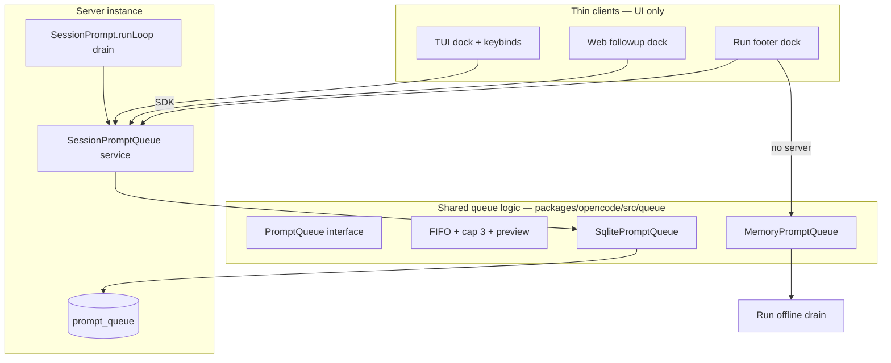

# Unified prompt queue — implementation plan

**Status:** implemented on `feat/main-tui-prompt-queue`
**Branch context:** replaces `delivery: "deferred"` queue hack on `feat/main-tui-prompt-queue`
**Upstream reference:** `origin/production` @ `1813256d8` (same tip as `origin/dev` at time of writing)

> **Supersedes:** [PLAN.md](./PLAN.md) and [PLAN_MAIN_TUI_QUEUE.md](./PLAN_MAIN_TUI_QUEUE.md) for queue semantics. Those files describe the pre-unified-queue approach.

---

## Executive summary

Unify TUI, Web, and Run `--interactive` on **one queue model**:

- **Persist** queued prompts in SQLite (`prompt_queue` table), not in `message` / `part` rows.
- **Steer** stays on the normal prompt path (`session.prompt` / `promptAsync`) with default **`immediate`** delivery.
- **Do not** use `delivery: "deferred"` for queueing; keep `deferred` on the API/schema **dormant** like upstream (accepted, no queue behavior).
- **Share** FIFO queue logic between server DB and Run-without-server via a common `PromptQueue` module; **demo mode does not queue**.

---

## Upstream findings (`origin/production`)

Investigation of the real production tree (not this feature branch):

| Area | Upstream state |
|------|----------------|
| `Session.Delivery` | `immediate` \| `deferred` in `packages/core/src/session/schema.ts`; `DefaultDelivery = "immediate"` |
| v2 HTTP API | `delivery` optional on `session.prompt` / `shell` / `skill`; handler passes `delivery ?? DefaultDelivery` |
| v2 `packages/core/src/session.ts` | `delivery` appears **only on the service interface** — **no implementation** reads it |
| `SessionRunState` | **No** in-memory deferred map |
| `session/prompt.ts` | **No** `delivery` / `defer` branches |
| `message-v2` User | **No** `delivery` field on persisted messages |
| TUI transcript “QUEUED” badge | **Heuristic:** user `message.id > pendingAssistant.id` — **not** `delivery === "deferred"` |
| TUI / Web queue dock | **Does not exist** on production |
| Run `runtime.queue` client FIFO | **Does not exist** on production |

**Conclusion:** On upstream, `immediate` / `deferred` is a **reserved API contract** only. Our branch repurposed `deferred` for queueing and introduced parallel stores (in-memory `MessageV2.WithParts[]`, Web `followup.v1`, Run local array). This plan **reverts queue semantics to a dedicated store** and **restores `delivery` to dormant** except where we need **`immediate` on persisted user messages for steer** in the run loop (see below).

### Steer vs queue (target semantics)

| User action | While session busy | Mechanism |
|-------------|-------------------|-----------|
| **Enter** (default) | Steer | `POST session.prompt` / `promptAsync`, `delivery` omitted or `immediate` → user row in transcript, loop interrupts/continues per `immediateTurnUnsettled` |
| **Queue** (Ctrl+Shift+Enter, queue mode, etc.) | Queue | `POST session.queue` → row in `prompt_queue` only |
| **Send now** on dock item | Flush one queue row | `POST session.queue/:id/send` → materialize user message + run loop |

This matches product intent and upstream’s default of **`immediate`**.

---

## Current branch debt (to remove)

| Location | What to remove / replace | Status |
|----------|---------------------------|--------|
| `session/run-state.ts` | `deferred: Map<…>` + `defer` / `popDeferred` / … | Done |
| `session/prompt.ts` | `if (input.delivery === "deferred" && hasRunner) { … defer … }` | Done |
| `session/prompt.ts` | `popDeferred` / `rekeyDeferredMessage` drain → DB dequeue | Done |
| `session/message-v2.ts` | deferred helpers — kept for **legacy rows** + migration reads | Partial (read-only legacy) |
| `session/session.ts` | `DeferredUpdated` → `QueueUpdated` | `QueueUpdated` primary; `DeferredUpdated` type retained for SDK compat |
| Web `session.tsx` | `persisted(…, "followup.v1").items` | Done (`followup.v2`, server queue) |
| Web `sendFollowupDraft(…, delivery: "deferred")` | queue API | Done |
| TUI `sync.deferred_queue` | `prompt_queue` from bus + bootstrap | Done |
| TUI `prompt/queue.ts` | legacy scan of `message.delivery === "deferred"` | Done (server list only) |
| Run `runtime.queue.ts` | local FIFO for deferred; keep **turn serializer** only | Done (`MemoryPromptQueue` + `queued`) |
| HTTP `…/deferred/:messageID` | `…/queue/:queueID` | Queue routes + deferred forward |

---

## Architecture



**Invariants**

1. Queued payloads **never** appear in `message` / `part` until dequeued.
2. **One** drain implementation for server (`runLoop`); Run-offline calls the same `dequeue` / `materialize` helpers with `MemoryPromptQueue`.
3. **Max 3** items per session, enforced in shared module.
4. **`delivery: "deferred"`** on `session.prompt` is **ignored** (dormant), same as upstream — clients must use queue endpoints.
5. **`--demo`**: queue key / `onQueue` **no-op** (optional status: “queue unavailable in demo”); steer/submit demo paths unchanged.

---

## Data model

### Table `prompt_queue`

```sql
-- Drizzle migration under packages/opencode/migration/
CREATE TABLE prompt_queue (
  id TEXT PRIMARY KEY,
  session_id TEXT NOT NULL REFERENCES session(id) ON DELETE CASCADE,
  position INTEGER NOT NULL,
  time_created INTEGER NOT NULL,
  data TEXT NOT NULL  -- JSON
);
CREATE INDEX prompt_queue_session_position_idx ON prompt_queue(session_id, position);
```

**`data` (version 1):** `{ agent, model, variant?, parts, tools?, permissions? }` — parts **resolved at enqueue** so edit/replay is stable.

**IDs:** `QueueItemID` (new branded id), distinct from `MessageID` until materialize.

### Legacy migration

One-time job (`deferred_user_messages_to_prompt_queue` in `data-migration.ts`):

- Rows in `message` where `data.delivery === "deferred"` and still “open” → insert into `prompt_queue` and remove message/parts.
- Processed deferred rows → strip `delivery` to `immediate`.

### `delivery` on User messages (post-change)

| Value | Use |
|-------|-----|
| **unset / `immediate`** | All persisted user messages, including **steer** |
| **`deferred`** | **Legacy read-only**; no new writes |

Keep `Session.Delivery` in core schema and OpenAPI **unchanged** for compatibility; document `deferred` on prompt body as **no-op** (dormant).

**Keep** `MessageV2.immediateTurnUnsettled` (steer unsettled turn) — it keys off **`immediate`** users after the assistant, not the queue table.

---

## Shared module: `packages/opencode/src/queue/`

Extend existing `preview.ts` with:

### `prompt-queue.ts`

```ts
// Conceptual — implement with Effect in repo style
interface PromptQueue {
  list(sessionID): Effect<QueueItemPreview[]>
  enqueue(sessionID, payload): Effect<QueueItem>      // throws QueueFull
  update(sessionID, id, payload): Effect<boolean>
  remove(sessionID, id): Effect<boolean>
  peek(sessionID): Effect<QueueItem | undefined>
  dequeue(sessionID): Effect<QueueItem | undefined> // pop head
}
```

- **`QUEUE_MAX = 3`**, FIFO by `position` + `time_created`.
- **`partsPreview`** for dock text (already shared).
- **`MemoryPromptQueue`**: `Map<sessionID, QueueItem[]>` — used by Run when there is no server.
- **`SqlitePromptQueue`**: Drizzle access — used by server `SessionPromptQueue` service.

**`materializeQueuedItem(item): MessageV2.WithParts`**: new message id/time, `delivery: "immediate"`, persist via existing `persistUserMessage`.

No duplication of FIFO rules between memory and SQL — both call shared `enqueueItem` / `shiftHead` pure helpers.

---

## Backend service: `SessionPromptQueue`

**File:** `packages/opencode/src/session/prompt-queue.ts`

Wraps sqlite queue + bus:

- Publishes `session.queue.updated` `{ sessionID, items: { id, text }[] }`.

**HTTP** (`packages/opencode/src/server/routes/instance/httpapi/groups/session.ts`):

| Method | Path | Action |
|--------|------|--------|
| `GET` | `/session/:sessionID/queue` | list (bootstrap) |
| `POST` | `/session/:sessionID/queue` | enqueue |
| `PATCH` | `/session/:sessionID/queue/:queueID` | update |
| `DELETE` | `/session/:sessionID/queue/:queueID` | remove |
| `POST` | `/session/:sessionID/queue/:queueID/send` | send now |

Legacy `/deferred/*` forwards to queue handlers.

**`session.prompt` handler:** `delivery: "deferred"` coerced to default immediate at persist time (dormant).

---

## `runLoop` drain (single place)

In `session/prompt.ts`:

```text
when turn settled && !immediateTurnUnsettled(msgs):
  item = promptQueue.dequeue(sessionID)
  if item: persist(materialize(item)); continue
```

**Do not dequeue** while `immediateTurnUnsettled` (regression tests from `77312d7eb` remain valid).

---

## Run `--interactive` without server

| Concern | Implementation |
|---------|----------------|
| **Queue storage** | `MemoryPromptQueue` in process (shared module), **not** `delivery: "deferred"` on API |
| **Enqueue** | Footer `onQueue` → `memoryQueue.enqueue` + `session.queue.updated`-shaped local event on footer |
| **Steer** | Unchanged: immediate `promptAsync` via transport steer path |
| **Drain** | When transport idle, `memoryQueue.dequeue` → materialize + `runPromptTurn` (same as server drain) |
| **With server** | All queue ops go through SDK → SQLite |

**Demo (`--demo`):** `onQueue` returns early; status “queue unavailable in demo”.

---

## Frontend (thin)

### Shared UI

- `packages/opencode/src/queue/queue-dock.tsx` — TUI + Run footer

### TUI

- Subscribe `session.queue.updated`; store `prompt_queue[sessionID]`.
- `queueInner` → `sdk.session.queue.enqueue`.
- Edit / send now → queue routes.

### Web

- `queueFollowup` → `client.session.queue.enqueue`.
- Dock from `prompt_queue` + bus; no client auto-drain.
- `settings.general.followup` `queue` vs `steer`.

### Run

- Queue → SDK or `MemoryPromptQueue` when offline.
- Steer → transport steer path.
- `queued: true` on footer submit (not `delivery: "deferred"`).

---

## Phases (one slice — do in order, single PR series or stacked commits)

### Phase 1 — Schema + shared module

- [x] Drizzle table + migration
- [x] `PromptQueue` interface + FIFO helpers + `MemoryPromptQueue` + `SqlitePromptQueue`
- [x] Unit tests: cap 3, FIFO, update/remove, session cascade delete
- [x] `materializeQueuedItem` helper + tests

### Phase 2 — Server service + drain

- [x] `SessionPromptQueue` service + `session.queue.updated` bus event
- [x] Wire `runLoop` dequeue (remove `run-state` deferred map)
- [x] Remove `prompt()` `delivery === "deferred"` branch
- [x] Ignore dormant `deferred` on prompt API (persist as immediate)
- [x] Legacy DB backfill migration for old deferred messages
- [x] Port / extend `packages/opencode/test/session/prompt.test.ts` queue + steer cases

### Phase 3 — HTTP + SDK

- [x] HttpApi queue routes; deprecate `/deferred/*`
- [x] Regenerate `packages/sdk/js`
- [x] Handler tests (`test/server/session-queue.test.ts`)

### Phase 4 — TUI + Web + Run clients

- [x] TUI sync + prompt enqueue/send/edit
- [x] Web: drop `followup.v1` items; wire dock to API
- [x] Run: `MemoryPromptQueue` offline; SDK online; demo no-queue
- [x] Delete dead code: `run-state` defer*, TUI legacy deferred scan

### Phase 5 — Cleanup + docs

- [x] `MessageV2` deferred helpers retained for legacy transcript rows only
- [x] Stop publishing `session.deferred.updated` alias (event type kept for SDK)
- [x] Update `PLAN.md`, `PLAN_MAIN_TUI_QUEUE.md` with pointer to this file
- [x] Changelog note below

---

## Testing matrix

| Test | Package | Status |
|------|---------|--------|
| Sqlite + memory FIFO parity | `packages/opencode/test/queue/` | pass |
| runLoop drain + steer holds queue | `test/session/prompt.test.ts` | pass |
| Queue not in transcript until dequeue | `test/session/prompt.test.ts` | pass |
| Restart durability (sqlite list after enqueue) | `test/queue/prompt-queue.test.ts` | pass |
| HttpApi CRUD | `test/server/session-queue.test.ts` | pass |
| Run offline memory queue | `test/cli/run/runtime.queue.test.ts` | pass |
| Demo ignores queue | `test/cli/run/runtime.queue.test.ts` | pass |
| TUI dock smoke | `test/cli/tui/prompt-queue-dock.test.ts` | pass |

---

## Changelog (user-facing)

- **Added** session queue API: `GET/POST /session/:id/queue`, `PATCH/DELETE /queue/:id`, `POST /queue/:id/send`.
- **Changed** queueing no longer uses `delivery: "deferred"` on `session.prompt`; that field is dormant (accepted, treated as immediate).
- **Changed** TUI, Web, and Run interactive mode share one server-backed queue (Run offline uses in-process `MemoryPromptQueue` with the same FIFO rules).
- **Migration** open deferred user messages are moved into `prompt_queue` on upgrade.

---

## Success criteria

1. One queue visible from TUI, Web, and Run (server-backed); Run-offline uses **same FIFO code** via `MemoryPromptQueue`.
2. No queued text in message list / scrollback until send/dequeue.
3. Steer = immediate prompt path everywhere; queue = queue API only.
4. `delivery: "deferred"` on prompt is **dormant** (upstream-parity); no new deferred user rows.
5. `--demo` does not queue.
6. `SessionRunState` has no message queue map.

---

## References

- Upstream production: `packages/core/src/session/schema.ts` (`Delivery`, `DefaultDelivery`)
- Upstream handler: `packages/opencode/src/server/routes/instance/httpapi/handlers/v2/session.ts`
- Current branch queue dock: `packages/opencode/src/queue/queue-dock.tsx`
- Session bug context: dequeue only when `!immediateTurnUnsettled` (`77312d7eb`)
